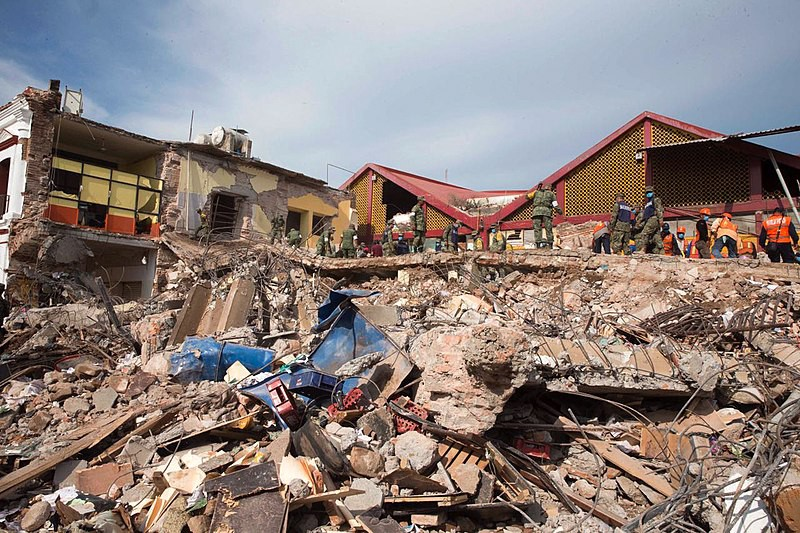
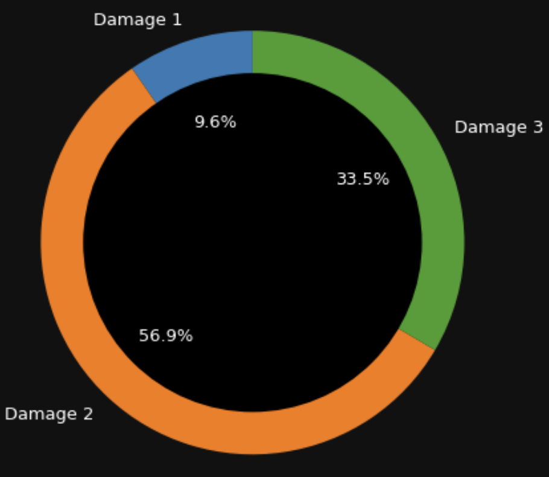
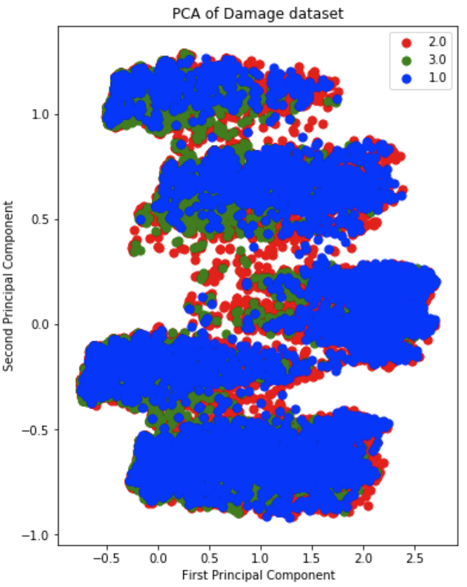
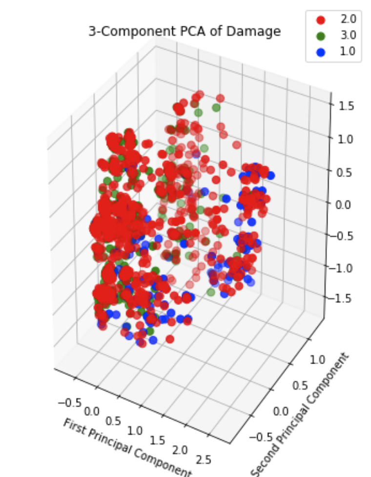
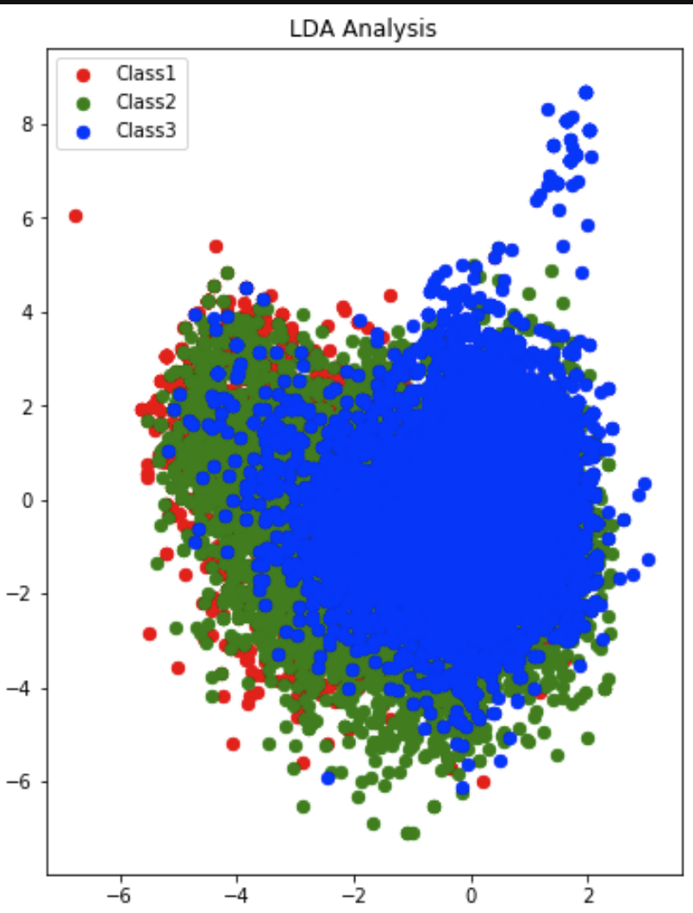
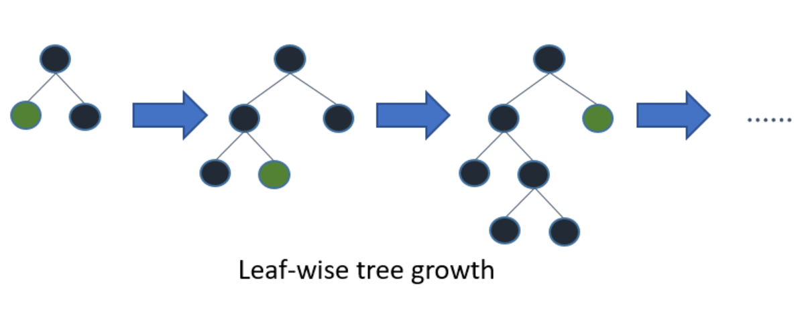
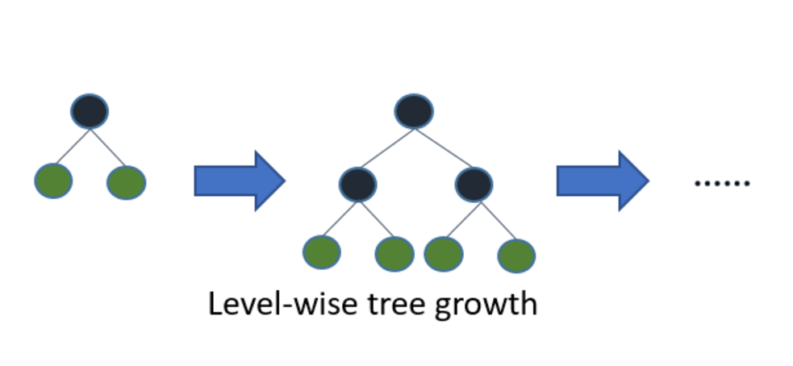
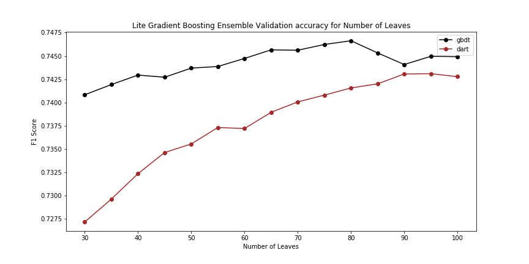

# Earthquake Damage Prediction

[Competition/Dataset Information](https://www.drivendata.org/competitions/57/nepal-earthquake/page/136/)

## Introduction and Background
Within the United States alone, earthquakes destroy nearly $4.4B of economic value yearly. Our team will be delving into the 2015 Nepal Earthquake Open Data Portal. This data, which was collected using mobile devices following the Gorkha Earthquake of April 2015, details the level of destruction brought upon more than 200,000 buildings in the area. By utilizing various features reported by Nepali citizens (such as building size, purpose, and construction material), we will construct a machine learning classifier capable of determining the extent to which a building would be damaged. We will also run unsupervised clustering algorithms to search for features that best represent the damage classifications. This project, combined with technologies such as the CV-based city scanners following earthquakes (Ji, 2018) will ultimately provide a better understanding of susceptibility to earthquake-induced damage, valuable information that can be leveraged by city planners.

## Methods
This project will be divided into two parts:
1. Data Preprocessing and Visualization
2. Model Selection, Training, and Evaluation

The data has been collected for us, but we plan to spend a significant amount of time preparing (cleaning, encoding, etc) the data for the model. We will also perform meaningful visualizations to better understand the relationships between our features. The classifier will be trained using supervised learning algorithms such as Support Vector Regressors (Asim, 2018), Logistic Regression, and Hybrid Neural Networks (Asim, 2018) and unsupervised learning algorithms such as  KMeans clustering. The hyperparameters will be tuned using the GridSearchCV process. The model performances will be compared using our test set and the one that generalizes the best will be chosen.

## Expected Results
Using supervised machine learning algorithms we hope to identify which factors affect the level of damage to a building from an earthquake. We’ll compare each of the results by micro averaged F1 score, which will balance precision and recall modified to gauge accuracy for classification into 3 categories (DrivenData). We can also use dimensionality reduction to reduce the number of features from 38 to a more manageable amount by seeing which features are correlated to each other.

# RESULTS

## Data Exploration and Preprocessing
Our initial approach was to scan for data imbalance, search for NaN values, and visualize the distributions of various features as well as the degree to which they correlation with the value we were trying to predict (damage grade).

Upon initial visualization, it becomes clear that this isn't a very highly predictive dataset. At most, the correlation of any given variable is +/- 0.2. In other words, it will likely be difficult to accurately classify the damage grades

In the initial data, we were also given a few categorical variables. These included land condition, roof type, floor type, legal status, and more. We used one-hot encoding to allow for models to be trained on this non-integer data. Fortunately, this data did not have any null values, so imputation was not necessary.

In terms of the data balance, the data is roughly imbalanced towards damage grade 2. However, it is not severe enough to have to add any special sampling techniques for the minority classes (in this case, damage 1).

Of the 38-feature dataset, 8 of the features were categorical. One-hot encoding was used to transform these categorical features into various binary featuresm prior to training any models.

## Methods

The data has been collected for us, but we plan to spend a significant amount of time preparing (cleaning, encoding, etc) the data for the model. We will also perform meaningful visualizations to better understand the relationships between our features. The classifier will be trained using supervised learning algorithms such as Support Vector Regressors (Asim, 2018), Logistic Regression, and Hybrid Neural Networks (Asim, 2018) and unsupervised learning algorithms such as KMeans clustering. The hyperparameters will be tuned using the GridSearchCV process. The model performances will be compared using our test set and the one that ​generalizes t​ he best will be chosen.

- Kmeans
- DBSCAN
- PCA
- LDA
- Cross validation
- Hybrid/Deep Neural Networks
- AutoML
- Decision Tree
- Random Forest Decision Tree
- XGBoost Decision Tree
 (add plots under section option)
 
### PCA and LDA
At the end of our preprocessing step, we were left with a total of 71 features after categorical encoding. 
It was not ideal for us to feed this into the classifiers and neural net architectures that we had constructed as it 
was entirely possible for us to capture the variability and patterns in the data with fewer features. Thus, we decided
to try some dimensionality reduction techniques to perform effective feature selection.

We began with **Principal Component Analysis**. It uses SVD to produce a set of vectors known as the principal components,
with the objective of capturing the maximum variability in the data with the fewest number of features. 

The results of PCA in 2 dimensions is shown below

It is quite clear that there isn't a discernable boundary between the principal components. The situation
does not improve much when visualized in 3 dimensions:

Thus, PCA did not prove to be effective with our dataset. We thus resorted to another method: 
Linear Discriminant Analysis. It simply attempts to express a linear dependence relationship between the features 
in order to root out features with no additional novel information. The results of LDA on the dataset are shown below:

Similar to PCA, there is no discernable clusters produced by LDA. To summarize, dimensionality reduction proved
to be of no use to us in terms of feature selection. We thus decided to move forward by maintaining all features in the dataset.

### DBSCAN and K-Means Clustering
Tried DBSCAN, but with the high dimensionality of the data (39 features with one-hot encoding) it was very difficult to get greater than 0 clusters unless the epsilon parameter was very high. In order to achieve some clusters the epsilon value had to be greater than 40 even with just a minpts of 3. Anything below that epsilon would result in 0 clusters. After trying some more variants of eps, a trial using an eps of 42, minpts of 3 and euclidian distance as the metric, we were able to get 3 clusters

Tried KMEANS while setting the number of n_clusters to 3 in hopes of clustering them close to damage grade. Just like with DBSCAN it seems KMEANS clustering does not perform well either with high dimensional data. KMEANS was able to provide an output of each datapoint to one of 3 clusters but after comparing all variations of cluster assignments to damage grade, the maximum accuracy we got was 33.5%.

### Neural Networks (using SKLearn and Keras)

One of the primary reasons for resorting to neural networks was due to the shear number of features to consider in the dataset.
They have proven to effectively capture complex non-linear hypothesis with high accuracy. 

We began with the Multilayer Perceptron algorithm, which resulted it in an accuracy of 51.2%. Naturally,
we tried adding more hidden layers using Keras in an effort to capture nuances in the dataset. Our accuracy was topped off at 56.89%. We used the following hyperparameters for the NN:

1. Optimizer: Stochastic Gradient Descent (SGD)
2. Loss: Categorical Cross-Entropy
3. Nestorov Momentum with a value of 0.9

From the results, it was clear that the ANN was unable to improve its classification accuracy beyond 56.89%. 

### AutoML
AutoML was utilized as a benchmark test to see if Microsoft Azure's "Automatic ML" classification would provide useful. One simply uploads the data, specifies the type of task they are seeking to perform (classification, in our case), and then Azure runs various ML algorithms on it with the purpose of optimizing performance. The results were equally poor with a lot of our previous testing, as visualized below.

### Decision Trees
There were 4 different types of decision trees that were evaluated including normal decision trees, random forest, extreme gradient boosting, and lite gradient boosting. Using the one-hot encoded data to convert categorical data into numerical data and 5-fold cross validation, a small version of each type of tree was created to compare their effectiveness by the F1 score metric. 

The results from the initial F1 score comparison demonstrate that random forest, extreme gradient boosting, and lite gradient boosting are more promising than the normal decision tree. The normal decision tree had already started overfitting the data since its train accuracy is significantly higher than its validation accuracy. Due to this overfitting, normal decision trees were not explored farther.

### Random Forest

Random forest decision trees reduce the variance in decision trees since they specify random feature subsets and build and combine many small trees. To make a prediction, random forest trees will either take the prediciton with the highest probability or average the predictions made by its smaller trees. By increasing the number of trees in the forest, both the training and validation accuracy increase due to the smaller tree averages converging on the true trends in the data. This is the idea of ensemble learning which is revisited later in the decision tree exploration.

### Extreme Gradient Boosting

Extreme gradient boosting also is composed of a set of decision trees but is built by training a tree to add to the forest. Instead of using an average or max of the probabilities from its trees while making predictions, extreme gradient boosting combines the tree prediciton results sequentially (Glen). Increasing the number of trees in the forest also improves the accuracy.

### Lite Gradient Boosting

Lite gradient boosting is also a gradient boosting framework, however it builds its trees by adding to leaves instead of adding levels.

This architecture is highly dependent on the number of leaves it expands. More leaves allow it to fit data better, but also can cause overfitting. This architecture can also be used with ensemble learning, and adding more trees will increase the accuracy. The results from the baseline accuracy tree test indicate that the tree should be made to fit the training data better since the train and validation accuracies were very similar. A comparison of the F1 score validation accuracies with varying the number of leaves is shown below.

The comparison of number of leaves above reveals that the optimal number of trees is 80. While evaluating the optimal number of trees, the F1 score constantly increases with diminishing reward. However, as the number of trees increases, the training time increases. 3,000 was the final number of trees selected.

The overall results from tuning are shown in the plot below.

This plot shows that the lite gradient boosting was the best technique at the end of the tuning done in this analysis.

### Competition Results
As a whole, our classification model performed better than expected. While we initially struggled with various common types of classification (KMeans, DBScan, PCA, LDA), we eventually found success in the form of an ensemble using the litegbm framework. The random forest decision tree demonstrated the advantage of ensembles. While trying extreme gradient boosting, we discovered lightGBM, a gradient boosting framework that builds trees by expanding leaves. This allowed the ensemble decision tree to converge faster and had better success after tuning the number of leaves expanded. The best results were a result of an ensemble of lightGBM trees.
We submitted our Lite Gradient Boosting method to classify the instances on their test set, and received the following results: 

## Discussion
This project can benefit architects, engineers, and city planners by using the classification model to extrapolate and predict types of buildings that are likely to suffer from earthquake damage. Buildings with attributes similar to those that were more damaged can be reinforced. Both the visualization and classification models can be used in conjunction with earthquake prediction research (Rouet-Leduc, 2017) to provide advance humanitarian aid so buildings can be reinforced to take significantly less damage.

## References
Asim, K. M., Idris, A., Iqbal, T., & Martínez-Álvarez, F. (2018). Earthquake prediction model using support vector regressor and hybrid neural networks. Plos One, 13(7). doi: 10.1371/journal.pone.0199004

DrivenData. (n.d.). Richter's Predictor: Modeling Earthquake Damage. Retrieved September 28, 2019, from https://www.drivendata.org/competitions/57/nepal-earthquake/page/136/

Glen, Stephanie. “Decision Tree vs Random Forest vs Gradient Boosting Machines: Explained Simply.” Data Science Central, 28 July 2019, www.datasciencecentral.com/profiles/blogs/decision-tree-vs-random-forest-vs-boosted-trees-explained.

Ji, M., Liu, L., & Buchroithner, M. (2018). Identifying Collapsed Buildings Using Post-Earthquake Satellite Imagery and Convolutional Neural Networks: A Case Study of the 2010 Haiti Earthquake. Remote Sensing, 10(11), 1689. https://doi.org/10.3390/rs10111689

Mandot, Pushkar. “What Is LightGBM, How to Implement It? How to Fine Tune the Parameters?” Medium, Medium, 1 Dec. 2018, medium.com/@pushkarmandot/https-medium-com-pushkarmandot-what-is-lightgbm-how-to-implement-it-how-to-fine-tune-the-parameters-60347819b7fc.

Rouet‐Leduc, B.,  Hulbert, C.,  Lubbers, N.,  Barros, K.,  Humphreys, C. J., &  Johnson, P. A. ( 2017).  Machine learning predicts laboratory earthquakes. Geophysical Research Letters,  44,  9276– 9282. https://doi.org/10.1002/2017GL074677 